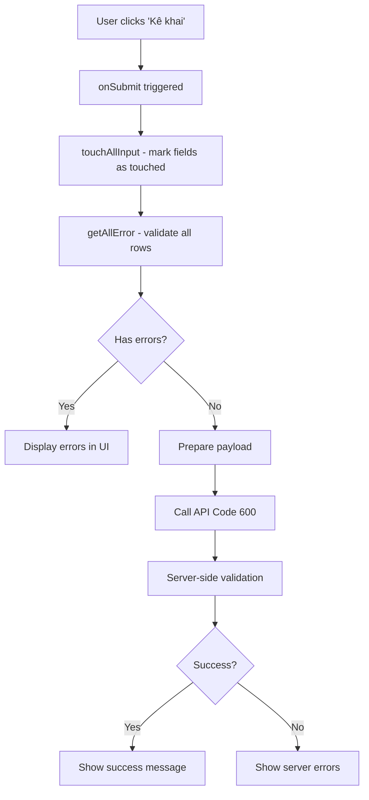
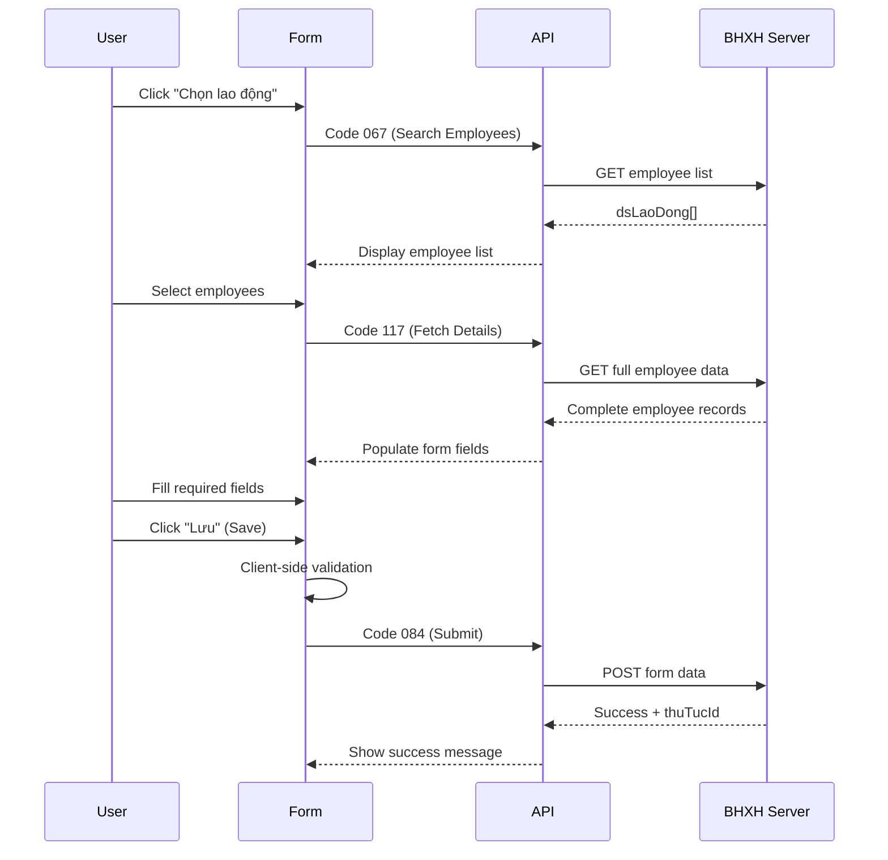

# API Code 600: Register/Adjust BHXH Contributions

**Purpose**: Submit monthly declarations for registering or adjusting BHXH, BHYT, and BHTN contributions for employees.

**Form URL**: `https://dichvucong.baohiemxahoi.gov.vn/#/ke-khai/thu-tuc-don-vi/600/ke-khai/{agencyCode}/{MM-YYYY}/{type}`

## Overview

Code 600 is the primary endpoint for submitting employee insurance registration and adjustment forms. The system supports three form types:
- **D02-TS**: Employee registration/adjustment (Đăng ký, điều chỉnh đóng BHXH)
- **TK1-TS**: Summary report (Tờ khai tổng hợp)
- **D01-TS**: Employee termination (Giảm lao động)

---

## Validation Process

### 1. Entry Point: `onSubmit` Method

When the user clicks the **"Kê khai"** (Declare) button, the Angular form submission triggers:

```typescript
onSubmit(formData) {
  // Step 1: Mark all fields as "touched" to display validation errors
  this.helper.touchAllInput(formData);
  
  // Step 2: Run comprehensive validation
  const errors = this.validateService.getAllError(
    this.dataTable, 
    this.formType, 
    ...
  );
  
  // Step 3: If errors exist, stop submission
  if (errors.length > 0) {
    return; // Silent failure - no API call
  }
  
  // Step 4: Proceed with API submission
  this.submitToAPI();
}
```

### 2. Core Validation Engine: `getAllError`

The `ValidateService.getAllError` method:
1. Iterates through each row in `dataTable` (list of employees)
2. Creates a temporary `FormGroup` for each row using `buildMauDO2Ts`
3. Checks each field against predefined validators
4. Attaches `errorList` object to each row for UI display

### 3. Form Builder: `buildMauDO2Ts`

This function defines the exact validation rules for each field in the D02-TS form.

---

## D02-TS Form Validation Rules

| Field Name     | Internal Key | Validation Rules                                         | Notes                   |
| -------------- | ------------ | -------------------------------------------------------- | ----------------------- |
| **Phương án**  | `pa`         | **Required**<br>Max length: 100                          | Plan/scheme identifier  |
| **Họ và tên**  | `Hoten`      | **Required**<br>Max length: 100                          | Employee full name      |
| **Mã số BHXH** | `Masobhxh`   | Max length: 10<br>Numeric format check                   | Social insurance number |
| **Chức vụ**    | `chucVu`     | **Required**<br>Max length: 500                          | Position/title          |
| **Tiền lương** | `tienLuong`  | **Required**<br>Min value: > 0<br>**Dynamic validation** | See special logic below |
| **Đã có sổ**   | `daCoSo`     | **Required** (Boolean)                                   | Has insurance book      |
| **Tính lãi**   | `tinhLai`    | **Required** (Boolean)                                   | Calculate interest      |
| **Ghi chú**    | `ghiChu`     | Max length: 500                                          | Notes/remarks           |

### Special Validation: Salary Field (`tienLuong`)

The salary field has **dynamic validation logic** via `setValidateTienLuongD02`:

```javascript
// Pseudo-code from reverse engineering
if (value <= 100 && !value.includes('.')) {
  // Treat as COEFFICIENT (Hệ số)
  mode = 'COEFFICIENT';
  enableFields(['phuCapCV', 'phuCapTNVK', 'phuCapTNNghe']);
} else {
  // Treat as AMOUNT (Tiền đồng)
  mode = 'AMOUNT';
  disableFields(['phuCapCV', 'phuCapTNVK', 'phuCapTNNghe']);
}
```

**Impact:**
- **Coefficient mode** (≤ 100, no decimal): Enables allowance fields
  - `phuCapCV`: Position allowance (Phụ cấp chức vụ)
  - `phuCapTNVK`: Seniority allowance (Phụ cấp thâm niên vượt khung)
  - `phuCapTNNghe`: Professional seniority (Phụ cấp thâm niên nghề)
- **Amount mode** (> 100 or has decimal): Disables allowance fields

---

## Error Display

Validation errors are displayed using Angular's reactive forms:

```html
<span class="data-error" *ngIf="row.errorList.Hoten">
  Không được để trống
</span>
```

**Error Messages:**
- `"Không được để trống"` - Cannot be left blank (required field)
- Field-specific errors for format/length violations

---

## Submission Flow



---

## Key JavaScript Functions

| Function                                     | Purpose                             | Location  |
| -------------------------------------------- | ----------------------------------- | --------- |
| `onSubmit(formData)`                         | Main submission handler             | `22.js`   |
| `validateService.getAllError(...)`           | Batch validation engine             | `main.js` |
| `buildFormService.buildMauDO2Ts(data, form)` | D02-TS form builder with validators | `main.js` |
| `helper.touchAllInput(form)`                 | Force display of validation errors  | `main.js` |
| `setValidateTienLuongD02`                    | Dynamic salary field validation     | `main.js` |

---

## Implementation Notes

1. **Client-side validation is mandatory** - No API call is made if validation fails
2. **Empty table = silent failure** - If no employees are added, the form won't submit
3. **All fields must be populated** - Even optional-looking fields may be required by the validator
4. **Salary mode matters** - Choose coefficient vs. amount carefully as it affects available fields
5. **Console logging** - The app logs `check form {thuTucId, nguoiLaoDong, ...}` for debugging

---

## API Submission Flow

When the form passes validation and is submitted, the following API codes are used:

### 1. Code 067: Search/List Employees

**Purpose**: Retrieve available employees for selection in the form.

**Payload**:
```json
{
  "code": "067",
  "data": {
    "maCoquan": "07906",
    "maDonVi": "TZH490L",
    "masobhxhuser": "TZH490L",
    "macoquanuser": "07906",
    "loaidoituonguser": "1",
    "PageSize": 10,
    "PageIndex": 1
  }
}
```

**Response**:
```json
{
  "dsLaoDong": [
    {
      "nldid": 123456,
      "Hoten": "Trần Hạ Trân",
      "Masobhxh": "7937368040",
      // ... other summary fields
    }
  ],
  "TotalRecords": 2
}
```

---

### 2. Code 117: Fetch Full Employee Details

**Purpose**: Get comprehensive employee information when selected for the form.

**Payload**:
```json
{
  "code": "117",
  "data": {
    "listNldid": [123456, 789012],
    "masobhxhuser": "TZH490L",
    "macoquanuser": "07906",
    "loaidoituonguser": "1"
  }
}
```

**Response**: Returns exhaustive employee details including:
- Full name, BHXH ID, address
- Contract details
- Current salary information
- Family member information
- Employment history

---

### 3. Code 084: Save/Submit Form Data ⭐

**Purpose**: **Main submission API** - Saves the filled Code 600 form to the server.

**Triggered by**: Clicking the **"Lưu" (Save)** button

**Payload Structure**:
```json
{
  "code": "084",
  "data": {
    "thuTuc": {
      "maThuTuc": "600",
      "kyKeKhai": "022026",        // Format: MMYYYY
      "maCoQuan": "07906",
      "maDonVi": "TZH490L",
      "status": 4                  // 4 = Draft/Recorded state
    },
    "D02-TS": {
      "nguoiLaoDong": [
        {
          "Hoten": "Trần Hạ Trân",
          "Masobhxh": "7937368040",
          "phuongAn": "TM",          // Method code: TM = Tăng mới (New Registration)
          "tienLuong": 5310000,
          "tuThang": "01/2026",      // Effective from month
          "denThang": "01/2026",     // Effective to month
          "chucVu": "Nhân viên bán hàng",
          "daCoSo": true,
          "tinhLai": false,
          "ghiChu": ""
        }
      ]
    },
    "TK1-TS": {
      "nguoiLaoDong": [
        {
          "Hoten": "Trần Hạ Trân",
          "Masobhxh": "7937368040",
          "listThanhVien": [
            // Family member details
          ]
        }
      ]
    },
    "listToKhai": [
      {"maToKhai": "D02-TS", "tenToKhai": "Đăng ký, điều chỉnh đóng BHXH"},
      {"maToKhai": "TK1-TS", "tenToKhai": "Tờ khai tổng hợp"}
    ]
  }
}
```

**Response** (Success):
```json
{
  "success": true,
  "message": "Lưu thành công",
  "thuTucId": 8092349
}
```

---

## Method Codes (Phương án)

The `phuongAn` field uses specific codes to indicate the type of registration:

| Code   | Vietnamese Name | English Translation | Description                             |
| ------ | --------------- | ------------------- | --------------------------------------- |
| **TM** | Tăng mới        | New Registration    | Register new employee for insurance     |
| **DC** | Điều chỉnh      | Adjustment          | Adjust existing employee's contribution |
| **TT** | Tăng thêm       | Additional Increase | Increase contribution level             |

---

## Status Codes

| Status | Meaning        | Description                                   |
| ------ | -------------- | --------------------------------------------- |
| **4**  | Draft/Recorded | Form saved but not yet submitted for approval |
| **1**  | Pending        | Submitted and awaiting approval               |
| **2**  | Approved       | Approved by BHXH agency                       |
| **3**  | Rejected       | Rejected by BHXH agency                       |

---

## Complete Submission Sequence




---

## Testing Recommendations

To test the validation logic:

1. **Add an employee** using the "Chọn lao động" button
2. **Leave required fields empty** and click "Kê khai" to see error messages
3. **Test salary modes**:
   - Enter `50` (coefficient mode) - allowance fields should enable
   - Enter `5000000` (amount mode) - allowance fields should disable
4. **Monitor console logs** for `check form` output
5. **Inspect network tab** - successful validation should trigger a POST to `/CallApiWithCurrentUser`

---

## Related Documentation

- [Code 137: Monthly Payment Obligation](code-137.md) - View payment details after submission
- [Code 514: Payment History](code-514.md) - Track payment status
- [Employee API Docs](employee_api_docs.md) - Employee data retrieval
