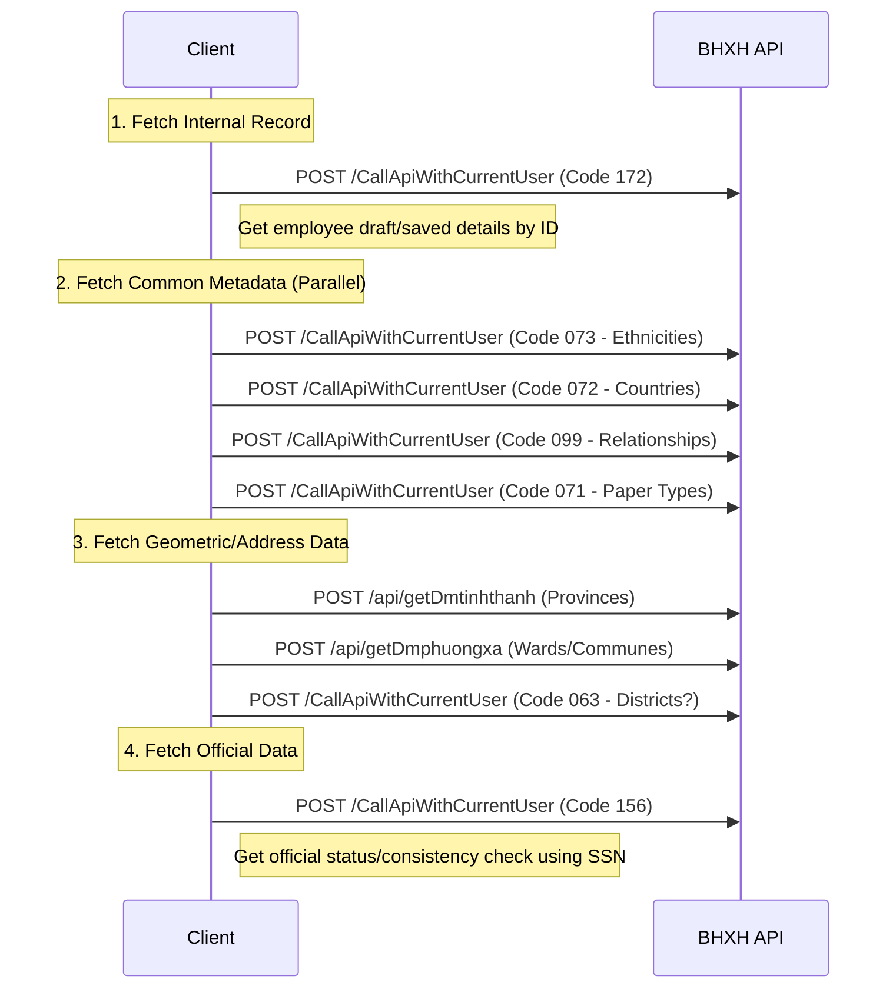

# Edit Employee API Flow

This flow is triggered when opening the "Edit Employee" form. It fetches the employee's saved internal record, reference metadata (dictionaries), and synchronizes with external/official BHXH data.

## 1. Sequence Diagram



## 2. Step-by-Step Details

### A. Get Employee Details (Code 172)
Fetches the existing record from the user's submission history/drafts.
*   **Payload**: `{"id": <Employee_Record_ID>}`
*   **Purpose**: Populates the form with currently confirmed values.

### B. Reference Data
Detailed dictionaries to populate dropdowns:
*   **Code 073**: Ethnicities (Kinh, Tay, Thai, etc.)
*   **Code 072**: Nationalities/Countries.
*   **Code 099**: Family Relationships (Head of household, child, spouse, etc.).
*   **Code 071**: Identity Paper Types (ID Card, Passport, etc.).

### C. Address Data
*   **`/api/getDmtinhthanh`**: List of all Provinces (Tinh/Thanh Pho).
*   **`/api/getDmphuongxa`**: List of Wards (Phuong/Xa). Payload `{"matinh": "...", "mahuyen": "..."}`.
    *   *Note*: in the trace, `mahuyen` is empty, suggesting fetching all wards for the province or pre-loading.
*   **Code 063**: Likely **Get Districts**. Payload `{"maTinh": "79"}` (Ho Chi Minh City).

### D. Official Data Sync (Code 156)
Fetches the employee's status from the central BHXH database to ensure the edit is valid.
*   **Payload**:
    ```json
    {
      "masoBhxh": "...",
      "maCqbh": "...",
      "maDonVi": "...",
      "isGetAll": false
    }
    ```
*   **Purpose**: Cross-check SSN, Insurance Status/Participation process.
